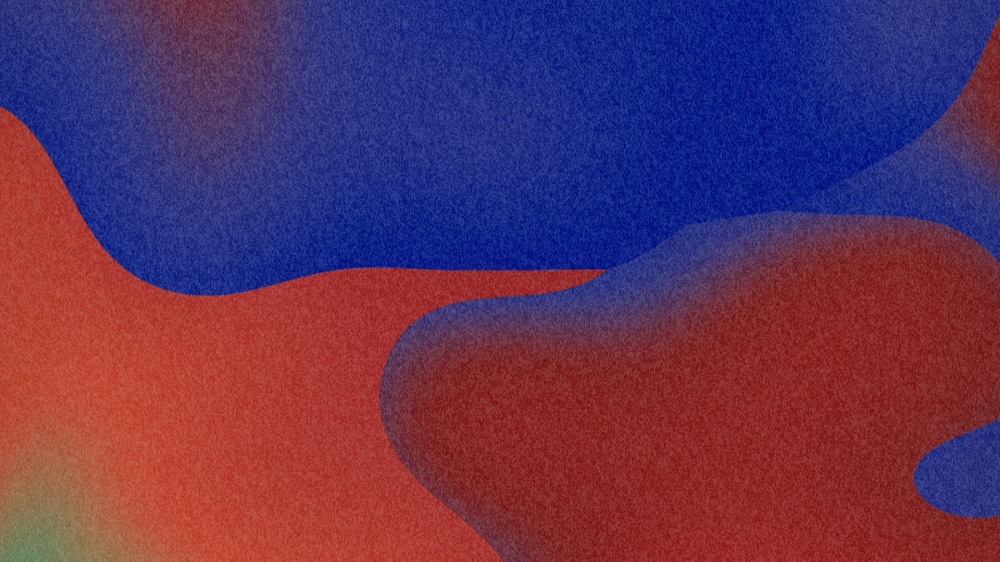
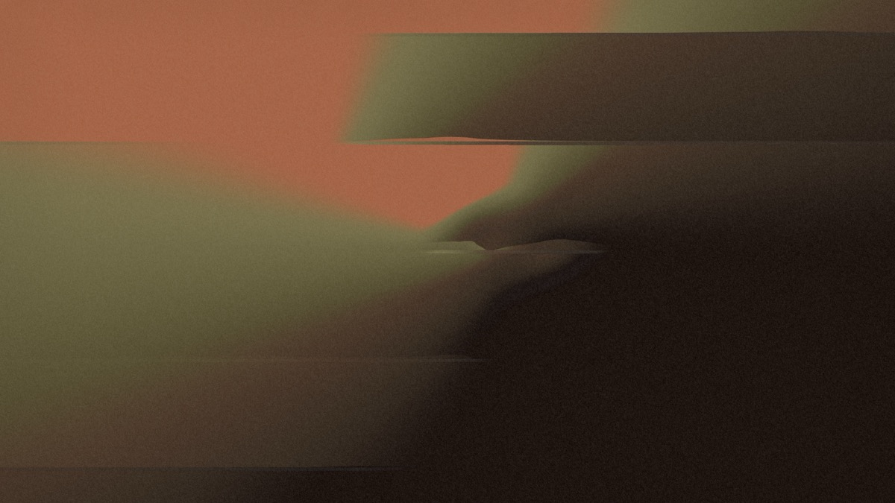
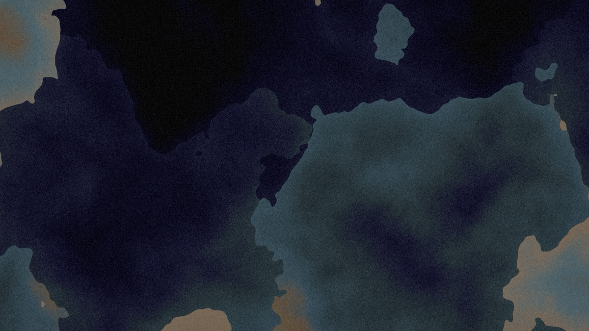
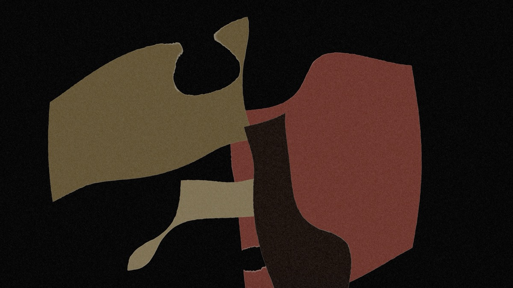
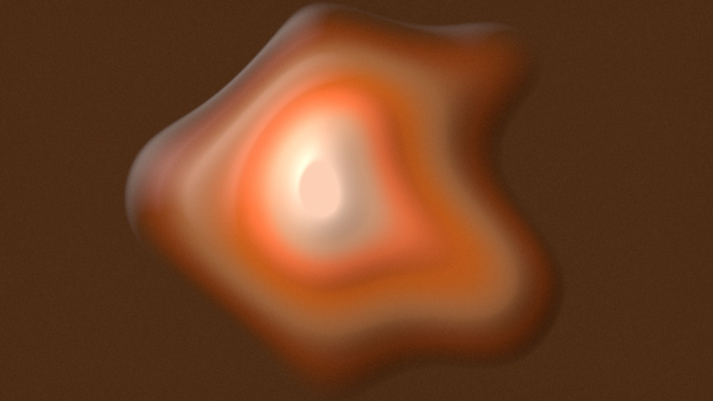
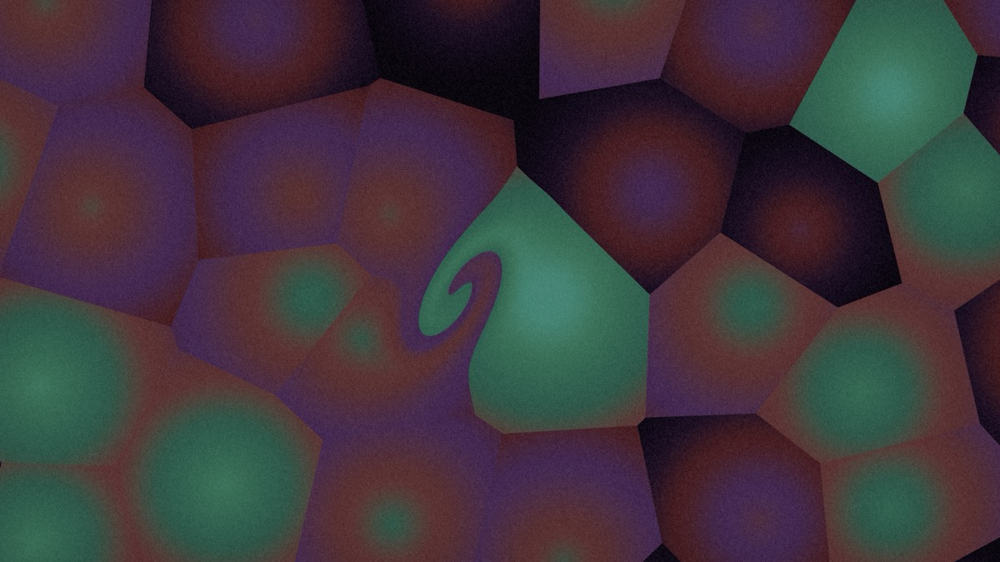
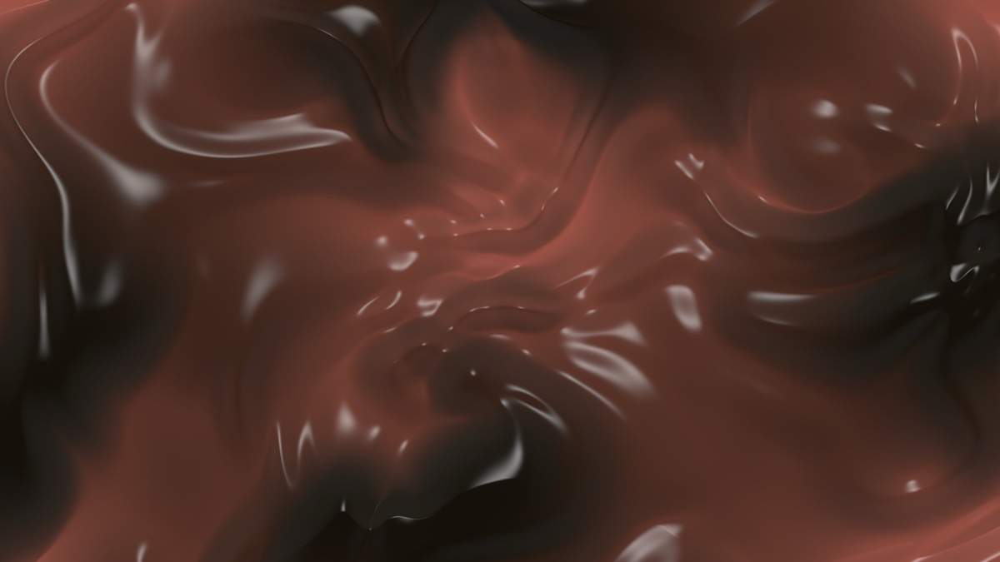
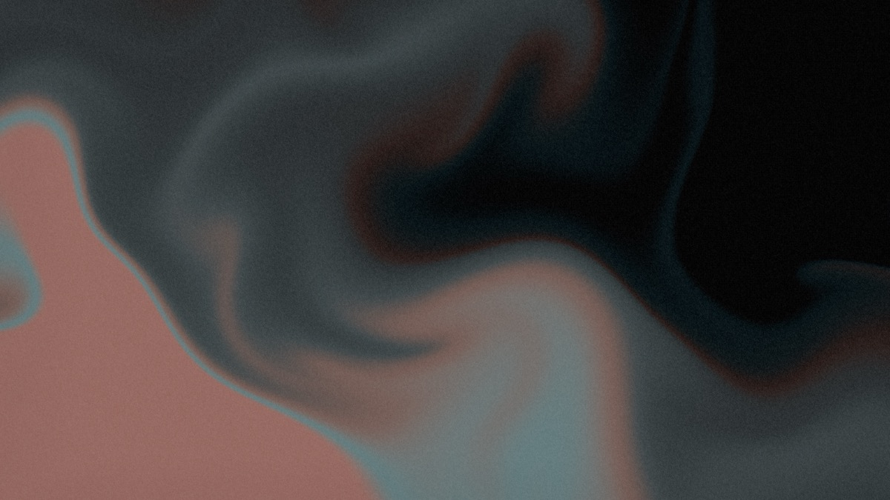
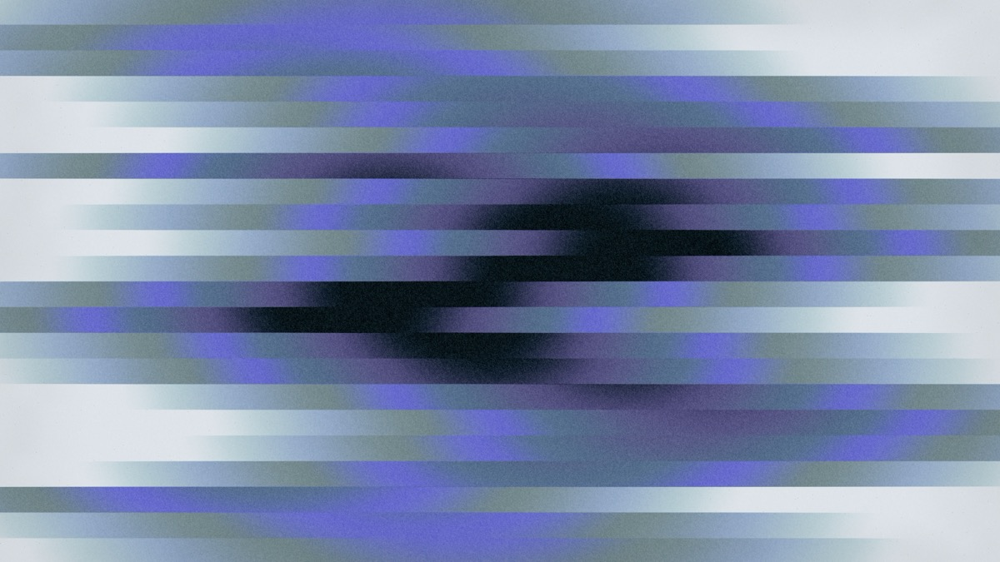

# cromatica

Generate abstract gradient wallpapers in your browser, at crisp, device-native resolutions. Everything runs client-side: no account, no upload.

**Try it: [zepocas.github.io/cromatica](https://zepocas.github.io/cromatica/)**

  
  
  
  
  
  
  
  
  

## Features

- **Five patterns:** color-point mesh, linear/radial/conic gradients, planes, aurora and grid.
- **Warps** such as silk and marble that bend any pattern into folds and flow.
- **Cohesive color:** palettes come from color theory, not random RGB. See [How colors work](#how-colors-work).
- **Finishes:** grain, bands, edge, brushed and print textures, plus blue-noise dithering so gradients never band.
- **Explore:** shuffle, "more like this" variations, history and favourites.
- **Export** PNG or JPEG at any size, rendered in tiles. A PNG carries its own design, so dropping it back into the app reopens it.
- **Autosave and undo/redo,** all local to your browser.

## How colors work

Shuffled palettes are built, not random. Each one combines:

- **A harmony rule** around a base hue: monochrome, analogous, complementary, split-complementary, triadic or tetradic.
- **A deliberate lightness spread,** so the colors stay distinct instead of blending into one mid-tone.
- **Balanced saturation.** Chroma is a fraction of what the display can show at that lightness and hue, so no color is garish or dull next to its neighbors. In the vivid moods with four or more colors, the base hue and one accent lead while the other hues stay calmer.
- **A mood** (natural, vivid, muted, earthy, pastel, neon) and a **value key** (light, full range or dark) to steer the feel.

Colors blend in Oklab, which looks even to the eye. The blends preserve chroma, so complementary colors don't turn gray in between. Edit one color with linking on and the rest follow, keeping the harmony. Or drop an image on the window to pull a palette from it.

Phase 1 is in progress; see the roadmap for where things stand.

- [Phase 1 plan](docs/PLAN.md)
- [Design decisions](docs/DECISIONS.md)
- [Roadmap (WIP)](docs/ROADMAP.md)

## Development

- **Run:** `npm run dev`. The app opens on the autosaved design (localStorage), or a shuffle on a first visit. `?default` in the URL opens the built-in design and leaves the save alone (the UI tests rely on it).
- **Checks:** `npm run lint` (ESLint), `npm run format:check` (Prettier; `npm run format` to fix), `npm test` (vitest), `npm run check` (svelte-check plus tsc), `npx playwright test` (about 2 min, SwiftShader; `PORT=<port>` to test a worktree's own dev server). `BENCH=1` adds timing logs and the render-time benchmarks; `SHEETS=1 npx playwright test sheets` writes visual sheets (warp contact sheets, six shuffles) to `$SHEETS_DIR` (default /tmp). The 5K warp benchmark can stall under load; rerun it alone before treating a timeout as a regression.
- **Test selectors:**
  - Many controls are behind "+ more", so tests click `More adjust settings` or `More colors settings` first.
  - Dropdowns are `src/ui/controls/Dropdown.svelte`, not `<select>`: use `choose()` and `valueOf()` from `tests/e2e/support/app.ts`.
  - Use `{ exact: true }` for labels that are substrings of others ("Harmony" and "Keep harmony", "Rotate" and "Rotate left").
- **Panel style** (`src/app.css` under `.panel`): monochrome, monospace, lowercase labels; `[ bracketed ]` buttons and glyph icons; dropdowns via `Dropdown.svelte` (native select popups can't be sized and scroll in Firefox-based browsers); sections via `src/ui/Section.svelte`; new controls go behind "+ more" unless they're core.
- **Commits:** one commit per milestone step, Conventional Commits.

## Support

If cromatica is useful to you, you can [buy me a coffee on Ko-fi](https://ko-fi.com/zepocas) ☕

## License

[MIT](LICENSE)
